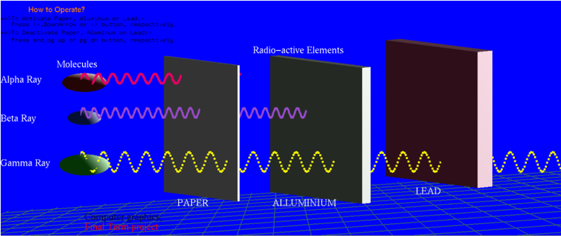

# Radiation Penetration Simulation (OpenGL)

A Computer Graphics project developed using C++ and OpenGL (GLUT). This application simulates the penetration behavior of radioactive elements (Alpha, Beta, and Gamma rays) against various shielding materials (Paper, Aluminum, and Lead).



## 📖 Project Overview

This tool offers a real-time, hands-on simulation to understand how different types of radiation interact with matter. It visualizes the sinusoidal motion of radiation particles and demonstrates their ability (or inability) to penetrate specific barriers.

- [cite_start]**Course:** Computer Graphics (CSC4118) [cite: 2, 3]
- [cite_start]**Institution:** American International University-Bangladesh (AIUB) [cite: 1]
- [cite_start]**Supervised By:** Shahnaj Parvin [cite: 8]

📄 **[Read the Full Project Report](docs/projectReport.pdf)**

---

## 🚀 Features

- [cite_start]**Real-Time Simulation:** Visualize Alpha, Beta, and Gamma rays moving in sinusoidal patterns[cite: 45].
- [cite_start]**Interactive Shielding:** Users can dynamically place or remove shielding materials (Paper, Aluminum, Lead)[cite: 47].
- [cite_start]**Educational Overlay:** On-screen instructions and labels for rays and molecules[cite: 49].

---

## 🛠️ Tech Stack & Requirements

**Software:**

- [cite_start]**Language:** C++ [cite: 32]
- [cite_start]**Graphics Library:** OpenGL (GLUT - OpenGL Utility Toolkit) [cite: 32, 33]

**Hardware:**

- [cite_start]**Processor:** Ryzen 5 5500U (or equivalent) [cite: 31]
- [cite_start]**RAM:** 8GB recommended [cite: 31]

---

## ⚙️ Installation & Setup

To run this project locally, you will need a C++ compiler (MinGW) and the GLUT library.

### Prerequisites

1.  **MinGW w64** (or any standard GCC compiler).
2.  **FreeGLUT** (MinGW version).

### Steps to Run (VS Code / Command Line)

1.  **Clone the repository:**
    ```bash
    git clone [https://github.com/MofakkarHM/Radiation-Penetration-Simulation.git](https://github.com/MofakkarHM/Radiation-Penetration-Simulation.git)
    cd Radiation-Penetration-Simulation
    ```
2.  **Setup GLUT:** Ensure `freeglut.dll` (or `glut32.dll`) is in the `src/` directory next to the executable.
3.  **Compile the code:**
    ```bash
    g++ src/main.cpp -o main -I"path/to/include" -L"path/to/lib" -lfreeglut -lopengl32 -lglu32
    ```
4.  **Run the application:**
    ```bash
    ./main.exe
    ```

---

## 🎮 Controls (How to Operate)

The simulation is controlled via the keyboard to activate or deactivate specific shielding walls.

| Action         | Shield Material | Key                  |
| :------------- | :-------------- | :------------------- |
| **Activate**   | **Paper**       | `Left Arrow` (`<-`)  |
| **Activate**   | **Aluminum**    | `Down Arrow`         |
| **Activate**   | **Lead**        | `Right Arrow` (`->`) |
| **Deactivate** | **Paper**       | `End`                |
| **Deactivate** | **Aluminum**    | `Page Up`            |
| **Deactivate** | **Lead**        | `Page Down`          |
| **Exit**       | N/A             | `n`                  |

---

## 🧪 Simulation Logic

### Radiation Types

1.  **Alpha Ray:** Low penetration power. [cite_start]Stopped by Paper[cite: 24, 27].
2.  **Beta Ray:** Medium penetration power. [cite_start]Passes Paper, stopped by Aluminum[cite: 25, 28].
3.  **Gamma Ray:** High penetration power. [cite_start]Passes Paper and Aluminum, stopped by Lead[cite: 26, 29].

---

## 👨‍💻 Author

**Mir Md. Mofakkar Hossain (Mahim)**

- **GitHub:** [MofakkarHM](https://github.com/MofakkarHM)
- **LinkedIn:** [[Mir Md Mofakkar Hossain](https://www.linkedin.com/in/mofakkarhossain/)]

---

## 📚 References

1.  [cite_start][OpenGL Official Site](https://www.opengl.org/) [cite: 73]
2.  [cite_start][Radiation Penetration Science](https://sciencedemonstrations.fas.harvard.edu/presentations/%CE%B1-%CE%B2-%CE%B3-penetration-and-shielding) [cite: 73]
